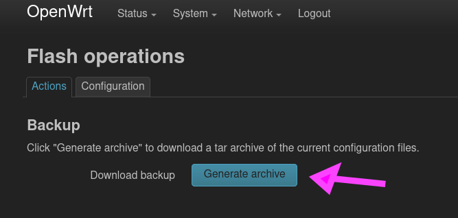

# Router Configuration

## Setup

Zur Zeit (WS23) verwenden wir zwei TP-Link AC1750 aus dem neuen Honeypot. Unter
`192.168.1.1` ist der Router zu erreichen, der Access Point hat die IP `192.168.1.2`.

Die Credentials der beiden OpenWRT-Management Interfaces sind `root:honeypotap`.

Um die beiden miteinander zu verbinden, einfach jeweils einen LAN-Port pro Geräte mit 
einem LAN-Kabel verbinden. Bitte nicht die WAN-Ports benutzen.

## Config Files

Die im WS23 verwendete Config findet sich in den beiden `backup-bob-*.tar.gz`-Dateien.
Um diese zu verwenden bitte sich einmal mit dem jeweiligen Router verbinden und von
der aktuellen Config ein Backup machen. Dazu im Tab `System\Backup` auf 
`Generate archive` klicken und herunterladen.

Danach kann im selben Tab eines der beiden Backups der `Basics of Bash`-Config per
`Upload archive...` hochgeladen werden.

Sollte mehr als ein Access Point verwendet werden sollen, einfach die IP des vorherigen
Access Points verändern und auf den neuen wieder das Access Point Backup hochladen.

